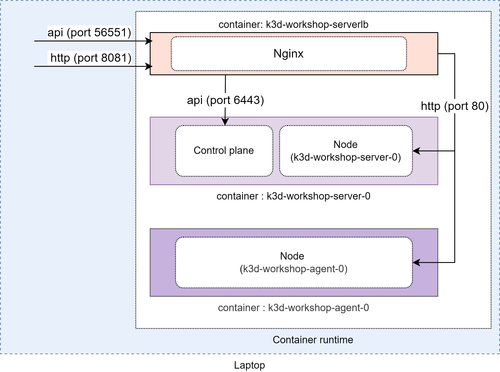

# Kubernetes

Une distribution kubernetes correspond à une version de kubernetes standard avec plus ou moins de services annexes pré-packagés.
Lors de cet atelier nous allons utiliser k3d qui est une version conteneurisée de [k3s](https://k3s.io/) elle-même une distribution de kubernetes construite par Rancher ([k3d](https://github.com/rancher/k3d))
Cela veut dire que notre _control plane_ et nos _nodes_ seront conteneurisées, on ne pourra pas accéder aux éléments comme c'est le cas sur un cluster managé par un clouder.

## Préparation

Docker et chocolatey (pour windows) doivent être installés, cf [prérequis](../prerequis.md)

- Installer k3d

<details>
<summary>Windows</summary>

```shell
# Depuis powershell avec une session admin
choco install k3d
# vérifier l'installation
k3d version
# k3s porte la version de kubernetes
```

</details>

<details>
<summary>Linux</summary>

```shell
wget -q -O - https://raw.githubusercontent.com/k3d-io/k3d/main/install.sh | bash
```

vérifier l'installation (k3s porte la version de kubernetes)

```shell
k3d version
```

</details>

Pour dialoguer avec le cluster et notamment son api nous allons utiliser le client kubectl.

La version majeure du client doit avoir au maximum 1 version majeure d'écart avec la version du cluster (compatibilité de l'api)

- Installer kubectl

<details>
<summary>Windows</summary>

Depuis powershell avec une session admin

```shell
choco install kubernetes-cli
```

vérifier l'installation

```shell
kubectl version --client
```

vérifier que le repertoire .kube existe

```shell
mkdir $HOME/.kube
```

</details>

<details>
<summary>Linux</summary>

Consulter la page officielle du client pour télécharger la bonne version de [kubectl](https://kubernetes.io/fr/docs/tasks/tools/install-kubectl/)

```shell
# vérifier l'installation
kubectl version --client
```

</details>

## Création du cluster

Création d'un cluster avec k3d

```shell
k3d cluster create workshop -a 1 -p "8081:80@loadbalancer"
```

- Si le port 8081 est déjà utilisé vous pouvez utiliser un autre port local
- L'option -p permet de mettre en place un proxy pour faire correspondre le flux d'entrée du cluster sur le port 80 avec un port local pour simuler un loadbalancer d'un clouder
- k3d créé un control plane et une node qui est nommé "master", l'option -a ajoute une node ou "agent" dans le cluster (on aura donc 2 nodes dans notre cluster)



## Arrêt du cluster

A la fin de l'atelier vous pouvez arreter et reprendre votre cluster, la base de données du cluster étant conservée dans un volume.

### Arreter le cluster

```shell
k3d cluster stop workshop
```

### Relancer le cluster

```shell
k3d clutser start workshop
```
