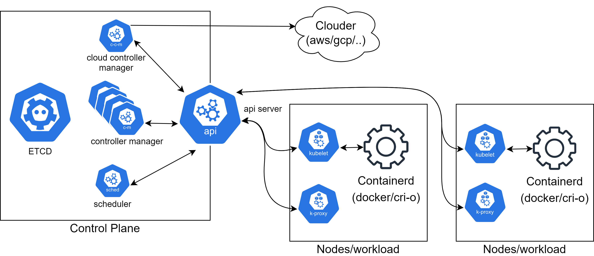

# Concepts

## Cluster kubernetes



### Control plane

La partie management du cluster est composée de plusieurs éléments qui sont souvent redondés. Dans un cluster managé le _control plane_ n'est pas accéssible directement et c'est le clouder qui le provisionne à la création du cluster.
Un cluster kubernetes s'efforce à tout instant de s'assurer que l'état souhaité correspond à l'état actuel du cluster, les actions sont réalisées par des déclenchements d'evenements asynchrones.

#### API

Le control plane expose une api qui permet aussi bien aux clients (un devops par exemple) qu'aux différents éléments techniques du cluster de communiquer avec les contrôleurs et les nodes.
L'api implemente REST, des certificats permettent de garantir l'origine des appels. L'api est versionnée et extensible.
Par exemple pour avoir l'état d'une node on va requeter l'api qui exposera l'état de la node en interrogeant les services nécessaires, on ne se connectera pas directement à une node.


#### ETCD

Base de données du cluster qui permet de stocker les ressources et "l'état déclaratif" du cluster.

#### Control manager

Contient la logique du cluster, il est composé de plusieurs contrôleurs qui interragissent avec les éléments du cluster.

#### Scheduleur

Réalise l'assignation des charges de travail (Pods) sur les nodes en utilisant différents algorithmes/contraintes imposées.

### Nodes

Les nodes forment la partie qui execute la charge de travail (Pods). Les nodes sont souvent hétérogènes. Dans un cluster managé les nodes sont gérées par le clouder aussi bien la partie provisonnement de l'instance (vm) que l'installation des composants et les configurations nécessaires pour rejoindre le cluster.

#### kubeproxy & kubelet

Sur une node on retrouve trois éléments:

- le kubeproxy pour la partie réseau
- le kubelet qui permet le dialoguer avec le control plane par l'api et qui dialogue avec le container runtime interface (CRI)
- le CRI souvent docker pour kubernetes < v1.22, cri-o kubernetes > v1.22

## Ressources

Dans un cluster kubernetes, tout élément est une ressource qui a une définition et des "instances" selon une version de l'API.
Une ressource a obligatoirement un nom, il faut ensuite consulter sa définition pour savoir les champs qu'il est possible de paramétrer lors de la création ou mise à jour d'une nouvelle ressource.
Le champ _kind_ et le champ _apiVersion_ permet à l'api server de valider en fonction de la définition de la ressource en question si la demande est valide.
Kubernetes offre en standard un certain nombre de ressources qu'il sait gérer, il est possible d'étendre l'api de kubernetes avec des ressources personnalisées (CRD).
Pour créer ou manipuler les ressources d'un cluster kubernetes on utilise le format de fichier yaml.

### Pods

Un pod est l'élément le plus simple et unitaire qu'un cluster kubernetes sait manipuler.
Un pod peut etre constitué d'un ou plusieurs containers docker qui vont partager le même contexte (stockage, réseau, isolation, linux namespace, cgroups...).
C'est l'unité "pod" qui sera ordonnancée sur une node et donc tous les containeurs au sein d'un pod seront orchestrés sur la même node.
Généralement on ne manipule pas directement les pods mais les ressources de plus haut niveau.

```yaml
apiVersion: v1
kind: Pod
metadata:
  name: nginx-envar-demo
spec:
  containers:
    - name: nginx-envar-demo-container
      image: nginx:1.14.2
      env:
        - name: DEMO_GREETING
          value: "Hello from the environment"
      ports:
        - containerPort: 80
```

Cycle de vide d'un pod


### Deploiement / StatefulSets / Deamonset / Jobs

Pour manipuler plusieurs pods, gérer la redondance, les notions d'haute disponibilité, kubernetes nous permet de déclarer des charges de travail (Deploiement/StatefulSets/Deamonset/Jobs/...).
Chaque type de charge de travail a ces propres propriétés en terme d'ordonnancement, de mise à jour des pods, ect. Cette ressource gère la gestion de la montée de version des pods, des rollbacks.

```yaml
apiVersion: apps/v1
kind: Deployment
metadata:
  name: nginx-deployment
  labels:
    app: nginx
spec:
  replicas: 3
  selector:
    matchLabels:
      app: nginx
  template:
    metadata:
      labels:
        app: nginx
    spec:
      containers:
        - name: nginx
          image: nginx:1.14.2
          ports:
            - containerPort: 80
```

Dans cet exemple on voit la notion de replicas qui indique le nombre de pod souhaité, cela veut dire que le cluster va essayer à tout moment de garantir l'execution de 3 pods nginx (pas forcement sur la même node).

### Services

Le service est une ressource qui permet de faire un abstraction au niveau réseau au dessus des pods. Il existe plusieurs types de services pour gérer différentes entrées du flux (Loadbalancer, ClusterIP, NodePort).
C'est le service qui réalise la répartition du flux entre le ou les pods en destination en se basant sur la disponibilité des pods. Il fait un pont par bind de port entre un flux entrant et les pods cibles. Un service peut gérer plusieurs ports d'entrée mais un port d'entrée doit correspondre à un seul port cible.

```yaml
apiVersion: v1
kind: Service
metadata:
  name: my-service-nginx
spec:
  selector:
    app: nginx
  ports:
    - protocol: TCP
      port: 8000
      targetPort: 80
```

### Configmaps & Secrets

Un cluster kubernetes manipule uniquement des ressources, une installation standard de kubernetes fournit donc avec des ressources pour répondre aux problèmatiques les plus courantes.
Il existe par exemple une ressource ConfigMap qui permet de stocker de la configuration qui pourra etre injecté dans un pod.
Les configmaps sont en clair, il existe une ressource sercets pour chiffrer des informations mais ce chiffrement est par défaut uniquement en base64.

```yaml
apiVersion: v1
kind: ConfigMap
metadata:
  name: exemple
data:
  ui_properties_file_name: "user-interface.properties"
  user-interface.properties: |
    color.good=purple
    color.bad=yellow
    allow.textmode=true
```

```yaml
apiVersion: v1
kind: Secret
metadata:
  name: secret-exemple
type: Opaque
data:
  password: cGFzc3dvcmQK
```

### CustomResourceDefinitions (CRD)

Il est possible d'étendre l'api de kubernetes pour gérer des ressources "non standard". Pour cela il faut installer au sein du cluster la définition de la nouvelle ressource à l'aide de la ressource CRD.
Cette nouvelle ressource pourra donc etre gérée et stockée dans le cluster. Pour traiter cette nouvelle ressource il faudra déployer dans le cluster une charge de travail (POD) qui sera capable de gérer cette nouvelle resosurce.
Par exemple velero qui est un outil de sauvegarde, déclare à son installation des CRD notamment une ressource permettant definir la périodicité des sauvegardes, cela permet de valider le paramétrage renseigné au contraire d'une configmap.

### ServiceAccount & Role

Il existe une ressource Role ou ClusterRole suivant le scope qui définit les actions possibles et les ressources accessibles sur l'api du cluster. Par défaut il existe des rôles prédéfinis mais on peut ajouter des roles personnalisés. Ces roles s'appliquent à un acteur par le biais d'une ressource. Cette ressource va lister les acteurs sur lesquels le rôle ou cluster rôle s'applique, c'est le RoleBinding ou ClusterRoleBinding en fonction du scope namespace ou cluster. Les acteurs sont souvent définis comme des ServiceAccount pour les utilisateurs techniques et les utilisateurs "humain".

## Deploiements

Schéma présentant une partie des ressources liées au déploiement d'une application.


## DNS

Dans une distirbution de kubernetes, un resolver dns est installé (CoreDNS). Il permet au cluster de faire la résolution dns à l'interieur du cluster.
Chaque élément d'un cluster a une ip dans le réseau virtuel du cluster (pods, service, ect). CoreDNS permet de résoudre ces IPs internes qui sont très volatiles par un nom.
A l'intérieur d'un namespace on pourra accéder à un service directement par son nom. On peut acceder au service d'un autre namespace par l'enregistement _&lt;service&gt;.&lt;namespace&gt;.svc.cluster.local_ (exemple: hello.workshop.svc.cluster.local)

## Helm

Dans l'atelier kubernetes nous allons voir comment déployer une application avec un ou plusieurs fichiers yaml. Cette façon d'installer est fonctionnelle mais n'est pas très souple ni très pratique.
Helm a été créé pour répondre à ces problématiques.

- Comment versionner le déploiement d'une application
- Comment suivre ce qui a été installé sur le cluster
- Comment gérer l'installation d'une application sur différents clusters/environnements (par exemple différent système de stockage chez les clouders)
- Comment packager efficacement et de manière lisible des installations complèxes

En regardant ce fichier qui installe l'ingress controller [nginx](https://raw.githubusercontent.com/kubernetes/ingress-nginx/controller-v0.44.0/deploy/static/provider/scw/deploy.yaml) on peut remarquer la difficulté à maintenir un tel fichier.

Helm adresse ces problèmatiques avec un client `helm` qui se connecte à l'api d'un cluster kubernetes sous la forme d'un binaire développé en `Go` (il utilise le même fonctionnment que `kubectl` avec kubeconfig).
Les applications/services à déployer seront packagés dans une `chart`. Helm utilise `gotemplate` pour proposer du templating en amont du déploiement. Helm installe les ressources dans un cluster kubernetes regroupé sous une `release`.

Une chart se présente sous la forme d'un tar.gz (version packagé) ou d'un repertoire contenant l'arborescence suivante :

```shell
charts/                # Charts en dépendance
templates/             # Repertoire des ressources yaml à templétiser
   deploiement.yaml    # Ressource yaml
   ingress.yaml
   service.yaml
   NOTES.txt           # Output présenté à l'utilisateur à la fin de l'installation (peut etre templétisé)
   _helpers.tpl        # Valeurs précalulées par templating
.helmignore            # Fichiers à ignorer lors du packaging de la chart
Chart.yaml             # Fichier principal de la chart
README.md              # Documentation ! très important pour comprendre comment configurer la chart !
values.yaml            # Valeurs par défaut
```

Le fichier principal `Chart.yaml` se présente comme une ressource (une version d'api et des clés/valeurs).

Il faut donc préciser la version v2 de l'api pour helm v3 (version v1 pour Helm v2).
La version de la chart permet de suivre le cycle de vie des modifications que l'on va pouvoir déployer.
La version applicative a son propre cycle de vie, elle correspond à un tag d'une image docker. Une montée de version applicative entraîne une montée de version de la chart, un changement dans la chart ne correspond pas forcement à une montée de version de l'application (même fonctionnement qu'une dépendance dans du code applicatif).

```yaml
# v2 for Helm V3 client
apiVersion: v2
# Chart name
name: front

# Chart description
description: A Helm chart for Kubernetes

# A chart can be either an 'application' or a 'library' chart.
#
# Application charts are a collection of templates that can be packaged into versioned archives
# to be deployed.
#
# Library charts provide useful utilities or functions for the chart developer. They're included as
# a dependency of application charts to inject those utilities and functions into the rendering
# pipeline. Library charts do not define any templates and therefore cannot be deployed.
type: application

# This is the chart version. This version number should be incremented each time you make changes
# to the chart and its templates, including the app version.
# Versions are expected to follow Semantic Versioning (https://semver.org/)
version: 0.1.0

# This is the version number of the application being deployed. This version number should be
# incremented each time you make changes to the application. Versions are not expected to
# follow Semantic Versioning. They should reflect the version the application is using.
appVersion: 1.0.0
```

Helm fonctionne de manière très simple, il va prendre tous les fichiers dans le répertoire `templates`, résoudre le templating à l'aide de contextes et de valeurs pour créer un fichier yaml qui contiendra toutes les ressources à déployer dans le bon ordre. Helm va comparer la précédente installation pour modifier uniquement les ressources en écart. Si le déploiement est valide, helm met à jour la release dans kubernetes pour indiquer la version et les ressources déployées, cette release sera la base de comparaison pour la prochaine installation.

Helm utilise les avantages du format yaml pour merger les fichiers :

```yaml
# values.yaml
application:
  env: test
database: test

# values-dev.yaml
application:
  debug: true
database: dev

# values.yaml + values-dev.yaml (merge dans l'ordre)
application:
  debug: true
  env: test
database: dev
```

Helm gère la mise à jour des ressources mais ne gère pas la prise en compte des changements, c'est le cluster kubernetes en fonction de son paramétrage qui va réaliser ces actions.
Par exemple, mettre à jour un secret ne relance pas les pods qui utilisent ce secret.


